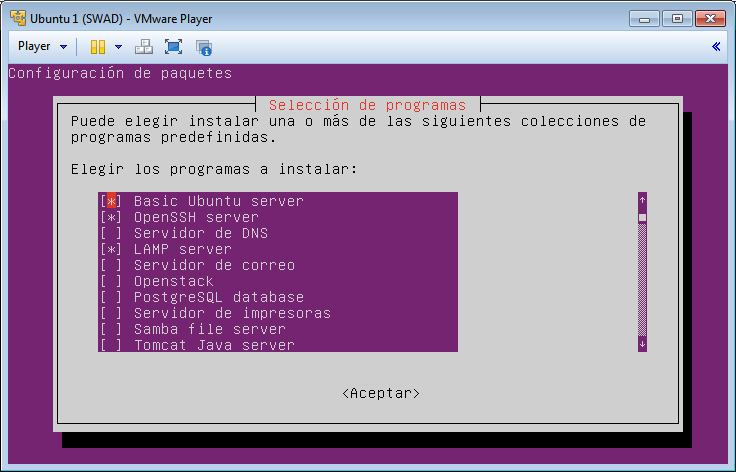

Servidores Web de Altas Prestaciones
====================================
3º Grado en Ingeniería Informática 2014/2015
--------------------------------------------

# PRÁCTICA 1: Preparación de las herramientas de prácticas.
### Juan Francisco Robles Fuentes

El objetivo de esta práctica es instalar y configurar las máquinas virtuales que utilizaremos durante el desarrollo de las prácticas de la asignatura. 
Las máquinas estarán alojadas en VM Player, correrán Ubuntu Server 12.04.2 LTS y, además, tendrán instalados y configurados Apache + PHP + MySQL.

### Instalación y configuración de las máquinas virtuales.
#### Automática. 
La primera opción es instalar Ubuntu de forma convencional e instalar Apache + PHP + MySQL durante el proceso de instalación. 
Para ello es necesario seguir los pasos indicados en el guión de prácticas y marcar la instalación de las herramientas en el paso correspondiente, tal y como se indica en la siguiente imagen:

#### Por línea de comandos.
La segunda opción es instalar las herramientas tras instalar Ubuntu usando el siguiente comando: 
`sudo apt-get install apache2 mysql-server php5 libapache2-mod-php5 php5-mysql`
`sudo taksel`.

### Comprobación del funcionamiento de las herramientas.
Comprobamos que se ha instalado correctamente el servidor Apache con el siguiente comando:
`ps aux | grep apache` (Este comando filtra los procesos del sistema y devuelve aquellos que contienen "apache")
El resultado sería el siguiente para la primera máquina: 

y el siguiente para la segunda: 

### Apertura de ficheros HTML.
Otra comprobación que necesitamos hacer es si el sistema es capaz de cargar archivos HTML. Para ello, siguiendo el guión, creamos un fichero HTML y lo llamamos 
curl: 
`curl http://localhost/archivo.html`
El resultado sería similar al que se muestra en la siguiente imagen:

### Conexión de las máquinas. 
Ante de nada necesitaremos conocer las direcciones IP de ambos servidores, podemos hacer esto usando `ifconfig`:

Como último paso, nos conectaremos desde el servidor 1 (alphaOne) mediante SSH al servidor 2 (alphaTwo):
`ssh boss@192.168.116.129`
Podemos navegar por el sistema de archivos para asegurarnos de que estamos en la otra máquina

