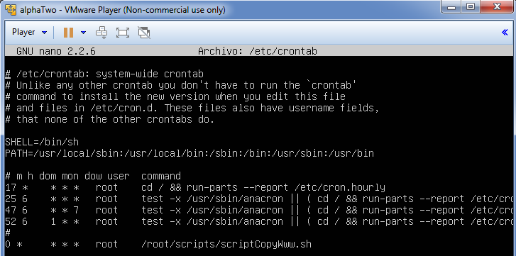

Servidores Web de Altas Prestaciones
====================================
3º Grado en Ingeniería Informática 2014/2015
--------------------------------------------


# PRÁCTICA 2: Clonar la información de un sitio web.
### Juan Francisco Robles Fuentes

Objetivos principales de la práctica:
* Aprender a copiar archivos mediante `ssh`.
* Clonar contenido entre servidores.
* Acceso a máquinas de forma remota sin contraseña usando `ssh`.
* Planificar tareas en `cron`.

En primer lugar copiaremos archivos entre servidores usando `ssh`. Copiaremos un directorio siguiendo los siguientes pasos: 
* Comprimimos con `tar` más los argumentos `czf -` el directorio.
* Enviamos el directorio comprimido con **“ssh”** al otro servidor como **“tar.tgz”**. 
* Comprobamos que el archivo se ha creado en la segunda máquina.


Para ficheros de más peso será necesario utilizar `rsync`, un software más potente que permite realizar copias controladas entre máquinas. Para hacer uso de este software podemos usar `rsync` con argumentos `-avz -e` y `ssh root@192.168.116.128:/var/www /var/`. Una vez lanzada la orden, se nos pedirá la contraseña del usuario **“root”**, acto seguido se mostrará por pantalla las acciones realizadas. 
Comprobamos que los archivos se han copiado correctamente.


Un aspecto importante de la práctica y de la gestión de servidores es el poder acceder entre máquinas de forma fluida. Para ello tendremos que permitir el acceso entre las másquinas mediante el uso de claves. 
Los pasos que hay que seguir para cubrir este objetivo son: 
* Generar la clave en el servidor desde el que se quiere realizar la conexión usando `ssh-keygen –t dsa`, que nos generará una clave DSA. 
* Asignar un nombre a la clave (en mi caso no le he dado ninguno y, por tanto, pasa a tener el nombre por defecto ide_dsa e ide_dsa.pub).
* Introducir una contraseña (ninguna en mi caso).


La clave se almacena en **“/root/.ssh/id_dsa.pub”**. 

* Copiar la clave al servidor al que nos queremos conectar usando `ssh-copy-id –i .ssh/id_da.pub root@192.168.116.128`. Ahora, con `rsync` podemos hacer copias vía `ssh` sin tener que introducir la contraseña para el acceso entre servidores. 


* Podemos consultar el archivo de claves permitidas en el primer servidor (**/root/.ssh/authorized_keys**), al final de este existe una entrada que indica que está permitida la conexión mediante `ssh` al usuario **“root”** desde el equipo **“alphaTwo”**.


Podremos comprobar el funcionamiento de la conexión sin clave conectándonos mediante `ssh` al servidor principal desde secundario ejecutando cualquier orden como `uname –a`.


En este momento podemos volver a realizar la copia del directorio **“/var/www/”** con `rsync` pasándole nuevos argumentos como `--delete` o `-- exclude` e indicando que nos vamos a conectar como **“root”** (-e `ssh –l root`). Si hemos realizado correctamente la creación y copiado de las claves, `rsync` se ejecutaría pedirnos que introduzcamos contraseña.


Para finalizar con los objetivos, se automatizará la copia con `rsync` mediante `cron`. Para ello se crea un script que se encargará de la operación de copiado con `rsync`.


Una vez creado el script, le damos permisos de ejecución con (`chmod 744 scriptActualizar.sh`) y lo probamos.


Para último, añadimos una nueva tarea al **“crontab”** con **“ nano /etc/crontab”**), para que cada hora se realice la copia de seguridad en nuestra máquina replicante, deberemos añadir:

```
0 *      * * *  root    /root/scriptActualizar.sh
```

Con esta línea indicamos que en el minuto **“0”** de cada hora, de cada día del mes, de cada mes, de cada día de la semana, el usuario **“root”** ejecute el script **“/root/scriptActualizar.sh”**, para que realice la copia del contenido actualizado del directorio **“/var/www/”** de la máquina principal a la máquina replicante.


