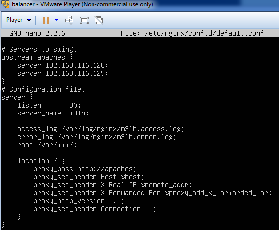
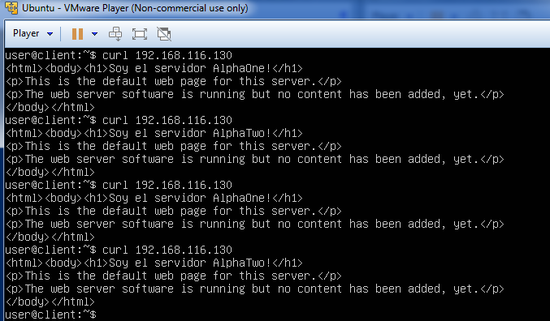
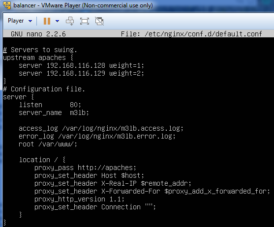

Servidores Web de Altas Prestaciones
====================================
3º Grado en Ingeniería Informática 2014/2015
--------------------------------------------

# PRÁCTICA 3: Balanceo de carga.
### Juan Francisco Robles Fuentes.

Objetivos principales de la práctica:
* Crear una máquina balanceadora para repartir la carga de trabajo entre los servidores de nuestra granja web.
* Instalar **"NginX"** y **"HAproxy"**, dos balanceadores de software libre. 
* Aprender a configurar los balanceadores para utilizar distintos algoritmos de balanceo. 
* Comprobar el correcto funcionamiento de la granja balanceada. 

Para comenzar esta práctica debemos instalar una nueva máquina virtual en nuestra granja web que servirá como balanceador de la misma. Para ello, tal y como hicimos en la primera práctica, instalamos **"Ubuntu Server 12.04 LTS"** junto con **"OpenSSH"**. 
En este caso no se usará la máquina como servidor por lo que no se instalará **"Apache"**. 
Los pasos a seguir para instalar **"Ubuntu Server 12.04 LTS"** están descritos en este tutorial: http://www.ubuntugeek.com/step-by-step-ubuntu-12-04-precise-lamp-server-setup.html

Una vez instalada la máquina, procederemos a instalar en ella **"Nginx"** como futuro balanceador software de nuestra granja. Para ello usamos los siguientes comandos: 
* cd /tmp/
* wget http://nginx.org/keys/nginx_signing.key
* apt-key add /tmp/nginx_signing.key
* rm -f /tmp/nginx_signing.key

* echo "deb http://nginx.org/packages/ubuntu/ lucid nginx" >> /etc/apt/sources.list
* echo "deb-src http://nginx.org/packages/ubuntu/ lucid nginx" >> /etc/apt/sources.list
* apt-get update
* apt-get install nginx

Una vez instalado **"Nginx"** lo configuraremos para que actúe como balanceador de nuestra granja. Para poder realizar esta tarea, tendremos que modificar el fichero de configuración situado en ` /etc/nginx/conf.d/default.conf` con nuestro editor de texto preferido (**"nano | vi | joe | ..."**). 
Para poder configurarlo correctamente necesitaremos: 
* IP's de los servidores. 
* Determinar un algoritmo de balanceo. 

### Balanceo Round Robin en Nginx. 

El primer algortimo de balanceo que usaremos con el balanceador será **"Round Robin (balanceo por turnos)"**. Para utilizarlo, tendremos que configurar el fichero de configuración de **"Nginx"** para que quede de la siguiente manera: 

Acto seguido reiniciamos nginx para que se aplique la nueva configuración con `sudo service nginx restart` y probamos que todo funciona correctamente haciendo uso de **"curl + IP balanceador"** desde la terminal de nuestro sistema o, en mi caso, desde una nueva máquina virtualizada que actúa como cliente. 
El resultado sebería ser similar al mostrado en la siguiente imagen: 

 
 
 Como puede verse en la imagen, los servidores atienden las peticiones de forma rotatoria. (El mensaje que muestran está contenido en /var/www/index.html)
 
 ### Balanceo Ponderado en Nginx. 
 
 Otra forma de balanceo que podemos usar en Nginx es el balanceo ponderado. Este algortimo asigna una prioridad a las máquinas en función a sus características (aunque la asignación de prioridades es tarea del administrador de la granja web).
 Para usar un algoritmo de balanceo debemos modificar el fichero de configuración de **"Nginx"** para asignale pesos a los servidores. Tendríamos la siguiente configuración: 
 
 
 
 Volvemos a usar **"curl + IP balanceador"** para comprobar el funcionamiento del algoritmo. 
 
 
 
 Con esta configuración, la máquina 2 (supuestamente más potente que la máquina 1) atiende más peticiones que la primera dado que tiene mayor prioridad para el balanceador.
 
 El siguiente paso de esta práctica es configurar otro balanceador software; **"HAproxy"**. Para ello tendremos que parar el servicio de **"Nginx"** ya que ambos utilizan el puerto 80 para sus conexiones. 
 Utilizamos `sudo service nginx stop` para parar el funcionamiento de Nginx y comenzamos a instalar HAproxy mediante el siguiente comando: 
 
 * sudo apt-get install haproxy
 
 Al igual que se hizo con nginx, modificamos el fichero de configuración de HAproxy para adaptarlo a nuestras necesidades. En este caso: 
 
 * sudo nano /etc/haproxy/haproxy.cfg 
 
 
 
 Finalmente lanzamos HAproxy con `sudo /usr/sbin/haproxy -f /etc/haproxy/haproxy.cfg` y probamos su funcionamiento tal y como lo hicimos con nginx.
 
 
 
