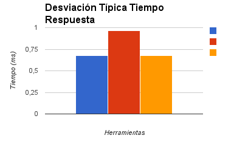

Servidores Web de Altas Prestaciones
====================================
3º Grado en Ingeniería Informática 2014/2015
--------------------------------------------

# PRÁCTICA 4: Balanceo de carga.
### Juan Francisco Robles Fuentes.

Objetivos principales de la práctica:
* Aprender a manejar distintas herramientas de testeo de rendimiento para probar distintas configuraciones de nuestra granja web.
* Familiarizarnos con Apache Benchmark, httperf y openwebload. 
* Estudiar el comportamiento y funcionamiento de estas herramientas.

Para comenzar esta práctica, es necesario instalar una máquina cliente desde la que realizar las peticiones a los servidores que forman la granja web. Podemos hacer esto siguiendo el manual de la práctica 1 de la asignatura.
Una vez instalada la máquina, comenzaremos a instalar las herramientas haciendo uso del gestor de paquetes `apt` si nos encontramos en Ubuntu Server o del gestor de paquetes correspondiente a nuestro sistema operativo: 
* Apache Benchmark: `sudo apt-get install apache2-utils`
* Httperf: `sudo apt-get install httperf`
* Openwebload: `sudo apt-get install openload`

Una vez las tengamos instaladas, estaremos preparados para comenzar los test sobre la granja web no sin antes comentar que, aunque las pruebas a las que serán sometidos los servidores por parte de las herramientas son similares, cada herramienta la realizará mediante un procedimiento propio que puede ser distinto al que usa otra herramienta. Así, por ejemplo, la tasa de solicitudes por segundo obtenida con **Apache Benchmark** sea diferente a la que obtengamos con **httperf**, por lo que no debemos compararlos entre sí, sino con los datos obtenidos con la misma herramienta.
Todas las herramientas realizarán la misma batería de pruebas; 10 mediciones de rendimiento con los mismos parámetros de entrada para el test que serán almacenados en tablas desde las que se obtendrán la media y la desviación típica de los resultados.
Para las pruebas, el cliente solicitará un archivo HTML con nombre **"pruebas_rendimiento.html"** alojado en los dos servidores balanceados en la práctica 2 cuyo contenido se muestra en la siguiente imagen:
* **Contenido Fichero** 

Las máquinas que intervendrán en la batería de pruebas serán: 
* **Servidor 1** con IP **192.168.116.128**
* **Balanceador** con configuración Nginx con IP **192.168.116.130**
* **Balanceador** con configuración Haproxy con IP **192.168.116.130**

Las gráficas que se obtendrán para los test mostrarán el tiempo empleado en realizar las peticiones al servidor y responderlas así como la tasa de peticiones atendidas por segundo (media y desviación típica). 
En los gráficos, las barras se corresponderán a cada una de las máquinas: 
* En azul: Servidor Individual.
* En rojo: Granja Web con balanceador Nginx.
* En amarillo: Granja Web con balanceador Haproxy.

## Tests con Apache BenckMark.

Los test que se realizarán con Apache Benchmark consistirán en solicitar el archivo **"pruebas_rendimiento.html"** 10.000 veces haciendo las peticiones con una concurrencia de 100 peticiones al mismo tiempo. Las órdenes a lanzar serían: 
* `sudo ab -n 10000 -c 100 http://192.168.116.128/pruebas_rendimiento.html` (servidor no balanceado)
* `sudo ab -n 10000 -c 100 http://192.168.116.128/pruebas_rendimiento.html` (Balanceador con Nginx)
* `sudo ab -n 10000 -c 100 http://192.168.116.128/pruebas_rendimiento.html` (Balanceador con Haproxy)

En Apache Benchmark el número de peticiones se indica con **-n** seguido del número deseado y el número de peticiones simultáneas con **-c** seguido del valor deseado.

Los resultados obtenidos tras los 10 test son los siguientes: 

|                     |                  Servidor                  |       Servidor       |         Servidor        |                    nginx                   |         nginx        |          nginx          |                   HAProxy                  |        HAProxy       |         HAProxy         |
|:-------------------:|:------------------------------------------:|:--------------------:|:-----------------------:|:------------------------------------------:|:--------------------:|:-----------------------:|:------------------------------------------:|:--------------------:|:-----------------------:|
|                     | Tiempo necesario para la prueba (segundos) | Solicitudes fallidas | Solicitudes por segundo | Tiempo necesario para la prueba (segundos) | Solicitudes fallidas | Solicitudes por segundo | Tiempo necesario para la prueba (segundos) | Solicitudes fallidas | Solicitudes por segundo |
|       Prueba 1      |                   28,017                   |           0          |          356,93         |                   50,768                   |           0          |          196,97         |                   44,063                   |           0          |          226,95         |
|       Prueba 2      |                   28,247                   |           0          |          354,02         |                   47,366                   |           0          |          211,12         |                   45,512                   |           0          |          219,72         |
|       Prueba 3      |                   26,018                   |           0          |          384,34         |                   49,956                   |           0          |          200,2          |                   44,513                   |           0          |          224,66         |
|       Prueba 4      |                   26,319                   |           0          |          379,95         |                   47,344                   |           0          |          211,22         |                   40,273                   |           0          |          248,3          |
|       Prueba 5      |                   27,657                   |           0          |          361,57         |                   51,765                   |           0          |          193,18         |                   40,544                   |           0          |          246,65         |
|       Prueba 6      |                   26,836                   |           0          |          372,63         |                   47,344                   |           0          |          211,77         |                   47,052                   |           0          |          212,53         |
|       Prueba 7      |                   28,421                   |           0          |          351,85         |                   48,29                    |           0          |          207,08         |                   41,564                   |           0          |          240,59         |
|       Prueba 8      |                   30,881                   |           0          |          323,82         |                   51,059                   |           0          |          195,85         |                   41,444                   |           0          |          241,29         |
|       Prueba 9      |                   27,052                   |           0          |          369,66         |                   45,05                    |           0          |          221,98         |                   41,781                   |           0          |          239,34         |
|      Prueba 10      |                   26,342                   |           0          |          379,65         |                   52,919                   |           0          |          188,97         |                   42,251                   |           0          |          236,68         |
|                     |                                            |                      |                         |                                            |                      |                         |                                            |                      |                         |
|        Media        |                   27,578                   |           0          |          363,65         |                   49,1732                  |           0          |         203,834         |                   42,251                   |           0          |         233,671         |
| Desviación estándar |                    1,439                   |         0,000        |          18,055         |                    2,486                   |         0,000        |          10,375         |                    2,261                   |         0,000        |          12,007         |

  

 

Como puede verse en las gráficas, en cuanto a tiempo de respuesta se refiere, parece que el servidor individual es capaz de ofrecer un mayor rendimiento ya que es capaz de realizar las pruebas en un tiempo menor que las granjas web y atender más peticiones. Si nos fijamos en la desviación típica de las peticiones antendidas por segundo la cosa cambia. Ahora, las solicitudes atendidas por segundo se disparan por lo que con un mayor número de peticiones es muy posible que el servidor individual ofrezca un menor rendimiento que la granja web.

## Tests con Httperf.

Lanzamos los test sobre las distintas máquinas: 
* `httperf --server 192.168.116.128 --port 80 --uri /pruebas_rendimiento.html --rate 100 --num-conn 5000 --num-call 1 --timeout 5` (Servidor)
* `httperf --server 192.168.116.130 --port 80 --uri /pruebas_rendimiento.html --rate 100 --num-conn 5000 --num-call 1 --timeout 5` (Balanceador Nginx)
* `httperf --server 192.168.116.130 --port 80 --uri /pruebas_rendimiento.html --rate 100 --num-conn 5000 --num-call 1 --timeout 5` (Balanceador Haproxy)

donde: 

* **--port** indica el puerto de conexión.
* **--uri** destino de las peticiones.
* **--server** Ip del servidor. 
* **--rate** número de peticiones por segundo.
* **--num-conn** número de peticiones TCP.
* **--num-call** número de llamadas. 
* **--timeout** tiempo de espera para las peticiones. 

|                     |             Servidor             |                 Servidor                |    Servidor   |               nginx              |                  nginx                  |     nginx     |              HAProxy             |                 HAProxy                 |    HAProxy    |
|:-------------------:|:--------------------------------:|:---------------------------------------:|:-------------:|:--------------------------------:|:---------------------------------------:|:-------------:|:--------------------------------:|:---------------------------------------:|:-------------:|
|                     | Duración de la prueba (segundos) | Tasa de solicitud (solicitudes/segundo) | Total errores | Duración de la prueba (segundos) | Tasa de solicitud (solicitudes/segundo) | Total errores | Duración de la prueba (segundos) | Tasa de solicitud (solicitudes/segundo) | Total errores |
|       Prueba 1      |              55,229              |                  907,5                  |       1       |              65,122              |                  278,6                  |    4417       |               58,937             |                  285,6                  |    3323       |
|       Prueba 2      |              55,29               |                  824,2                  |     451       |              64,698              |                  283,5                  |    4011       |               57,973             |                  325,9                  |    3128       |
|       Prueba 3      |              55,716              |                  854,4                  |     266       |              65,19               |                  319,2                  |    4235       |               59,878             |                  306,6                  |    3193       |
|       Prueba 4      |              56,269              |                  844,6                  |     308       |              63,889              |                  316,1                  |    4070       |               58,831             |                  316,9                  |    3138       |
|       Prueba 5      |              56,017              |                  783,9                  |     651       |              64,746              |                  289                    |    4090       |               58,567             |                  324,4                  |    3091       |
|       Prueba 6      |              56,725              |                  578,9                  |    1740       |              63,032              |                  249,4                  |    4434       |               58,781             |                  317,9                  |    3128       |
|       Prueba 7      |              56,11               |                  629,4                  |    1488       |              62,076              |                  248,4                  |    4316       |               58,003             |                  296,3                  |    3333       |
|       Prueba 8      |              56,495              |                  606,4                  |    1597       |              59,403              |                  289,7                  |    4323       |               58,229             |                  299,8                  |    3271       |
|       Prueba 9      |              56,463              |                  502,4                  |    2185       |              64,648              |                  311,7                  |    3906       |               58,877             |                  307,5                  |    3209       |
|      Prueba 10      |              56,231              |                  548,7                  |    1923       |              61,873              |                  287,8                  |    4346       |               58,566             |                  317,5                  |    3151       |
|                     |                                  |                                         |               |                                  |                                         |               |                                  |                                         |               |
|        Media        |              56,0545             |                  708,04                 |    1061       |              63,4677             |                  287,34                 |    4190,8     |               58,694             |                  309,84                 |    309,84     |
| Desviación estandar |               0,502              |                  149,06                 |    802,767    |               1,8741             |                  24,70                  |     168,89    |               0,5211             |                  13,04                  |     13,043    |

  

 

En este caso, el tiempo de prueba es muy similar en las tres configuraciones y puede volver a comprobarse que la desviación típica del servidor individual en el número de peticiones por segundo es muy alta lo que no lo hace especialmente fiable para pruebas más costosas de carga.
## Tests con OpenWebLoad.

Lanzamos los test sobre las distintas máquinas: 
* `openload 192.168.116.128/pruebas_rendimiento.html 10` (Servidor)
* `openload 192.168.116.130/pruebas_rendimiento.html 10` (Balanceador Nginx)
* `openload 192.168.116.130/pruebas_rendimiento.html 10` (Balanceador Haproxy)

|                     |             Servidor             |                 Servidor                |               nginx              |                  nginx                  |              HAProxy             |                 HAProxy                 |
|:-------------------:|:--------------------------------:|:---------------------------------------:|:--------------------------------:|:---------------------------------------:|:--------------------------------:|:---------------------------------------:|
|                     | Duración de la prueba (segundos) | Tasa de solicitud (solicitudes/segundo) | Duración de la prueba (segundos) | Tasa de solicitud (solicitudes/segundo) | Duración de la prueba (segundos) | Tasa de solicitud (solicitudes/segundo) |
|       Prueba 1      |               0,026              |                  367,31                 |               0,085              |                  116,85                 |                0,094             |                  103,99                 |
|       Prueba 2      |               0,027              |                  355,78                 |               0,084              |                  116,79                 |                0,089             |                  109,76                 |
|       Prueba 3      |               0,03               |                  325,85                 |               0,088              |                  108,7                  |                0,089             |                  108,62                 |
|       Prueba 4      |               0,028              |                  344,25                 |               0,084              |                  117,67                 |                0,088             |                  112,63                 |
|       Prueba 5      |               0,03               |                  328,43                 |               0,089              |                  110,65                 |                0,096             |                  102,63                 |
|       Prueba 6      |               0,03               |                  330,36                 |               0,082              |                  118,91                 |                0,09              |                  110,57                 |
|       Prueba 7      |               0,029              |                  340,05                 |               0,088              |                  110,2                  |                0,092             |                  105,67                 |
|       Prueba 8      |               0,028              |                  349,59                 |               0,087              |                  113,59                 |                0,086             |                  113,65                 |
|       Prueba 9      |               0,029              |                  338,26                 |               0,089              |                  110,95                 |                0,088             |                  111,71                 |
|      Prueba 10      |               0,029              |                  333,54                 |               0,085              |                  117,58                 |                0,095             |                  102,35                 |
|                     |                                  |                                         |                                  |                                         |                                  |                                         |
|        Media        |               0,0286             |                  341,34                 |               0,0861             |                  114,189                |               0,0907             |                  108,134                |
| Desviación estandar |               0,00134            |                   13,159                |               0,00242            |                   3,7883                |               0,0033             |                   4,24                  |

  

 

En este caso, el servidor individual muestra el mejor tiempo de prueba y trabajo (mayor número de peticiones atendidas por segundo) aunque sigue teniendo una desviación típica muy alta con respecto a las configuraciones de la granja web.

En conclusión, como se puede comprobar en los gráficos anteriores, un servidor individual puede ofrecer un mayor rendimiento que una granja debido, en parte, al trabajo que tiene que realizar el balanceador al repartir la carga del sistema entre las máquinas del mismo y repartir el trabajo entre ellas pero aparece un comportamiento muy importante a la hora de analizar la desviación típica de las peticiones atendidas por segundo y es que el servidor individual oscila mucho en este aspecto lo que lo hace muy propenso a sufrir caídas y mal rendimiento en sistemas en los que se produce una gran carga de trabajo. 

## Parte Optativa. 

## PRUEBAS CON APACHE JMETER

Para realizar las pruebas se ha realizado una configuración básica tal y como se indica en ([http://jmeter.apache.org/usermanual/jmeter_proxy_step_by_step.pdf](http://jmeter.apache.org/usermanual/jmeter_proxy_step_by_step.pdf)). El primer paso es añadir un grupo de hilos, pulsamos sobre nuestro plan de prueba **“PRACTICA 4: SWAP”** con el botón derecho y **“Add -> Threads (Users) -> Thread Groups”**, aquí vamos a indicar que el número de usuarios será 10 (**Number of Threads (users)**) y que se harán 500 solicitudes por usuario (**Loop Count**):

Añadimos también al grupo de hilos un **“Add -> Config Element -> HTTP Request Defaults”** y **“Add -> Logic Controller -> Recording Controller”**. Al **“Recording Controller”** le añadimos **“Add -> Sampler -> HTTP Request”** y a su vez a este le añadimos **“Add -> Config Element -> HTTP Header Manager”**, de estos dos últimos elementos deberemos añadir un par por cada servidor que vayamos a probar, 4 en nuestro caso, configurando cada uno con sus direcciones IP, ruta del archivo a solicitar e información de cabecera correspondiente:

Finalmente tendremos que añadir al grupo de servidores un **“Add -> Listener -> Summary Report”** para que nuestro el resultado de cada una de las ejecuciones de las pruebas. Para que las pruebas se vayan realizando de forma individual solo vamos a tener activa una sonda simultáneamente, así que desactivamos las otras con pulsando el botón derecho sobre ella y seleccionando **“Disable”**. Ya solo nos queda iniciar la prueba pulsando el menú **“Run -> Start”**.

La apariencia final debe quedar como se muestra a continuación: 

Si observamos los resultados, vemos que las son muy similares, e incluso las desviaciones estándares dan un valores muy bajos, por lo que podemos suponer que la concurrencia bajo este tipo de pruebas se maneja de forma distinta a como se hacía en los otros programas. Ninguno de los sistemas ofrece resultados tan distintos como para poder afirmar que tiene mayor rendimiento que los demás, Apache tiene mejores valores en el tiempo promedio de respuesta, pero HAProxy promedia un mayor número de peticiones por segundo.

|                     |            Servidor            |             Servidor             |              nginx             |               nginx              |             HAProxy            |              HAProxy             |
|:-------------------:|:------------------------------:|:--------------------------------:|:------------------------------:|:--------------------------------:|:------------------------------:|:--------------------------------:|
|                     | Tiempo promedio respuesta (ms) | Número de peticiones por segundo | Tiempo promedio respuesta (ms) | Número de peticiones por segundo | Tiempo promedio respuesta (ms) | Número de peticiones por segundo |
|       Prueba 1      |               17               |               123,8              |               23               |               120,8              |               17               |               123,3              |
|       Prueba 2      |               16               |               123,3              |               23               |               126,5              |               17               |               128,7              |
|       Prueba 3      |               17               |               120,7              |               24               |               123,8              |               18               |               123,3              |
|       Prueba 4      |               17               |               123,3              |               22               |               125,7              |               17               |               121,1              |
|       Prueba 5      |               17               |                121               |               24               |               123,3              |               18               |               123,8              |
|       Prueba 6      |               16               |               125,7              |               23               |               123,3              |               16               |               125,8              |
|       Prueba 7      |               16               |               126,5              |               21               |               121,1              |               17               |               126,5              |
|       Prueba 8      |               16               |               128,7              |               22               |               127,1              |               16               |               126,5              |
|       Prueba 9      |               16               |               127,1              |               22               |               126,5              |               17               |               120,8              |
|      Prueba 10      |               15               |               126,5              |               22               |               128,7              |               16               |               127,2              |
|                     |                                |                                  |                                |                                  |                                |                                  |
|        Media        |              16,3              |              124,66              |              22,6              |              124,68              |              16,9              |               124,7              |
| Desviación estandar |              0,675             |               2,659              |              0,966             |               2,628              |              0,738             |               2,642              |

  

 
