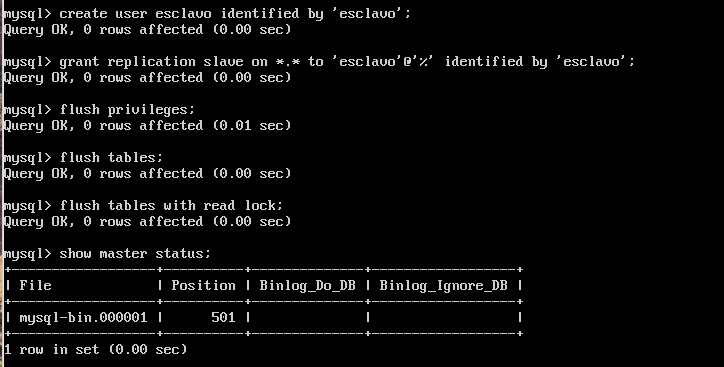

Servidores Web de Altas Prestaciones
====================================
3º Grado en Ingeniería Informática 2014/2015
--------------------------------------------

# PRÁCTICA 5: Replicación de bases de datos de MySQL
### Juan Francisco Robles Fuentes

En esta práctica de la asignatura aprenderemos cómo pueden replicarse las bases de datos que respaldan nuestra granja web y en las que se almacenan todos y cada uno de los datos que se utilizan en las aplicaciones web para dar vida a las mismas aplicaciones o para informar a los usuarios y potenciales clientes de las mismas. 

Los apartados que se estudiarán en esta práctica son dos principalmente: 
* Aprender a exportar los datos de nuestras bases de datos entre los servidores de la granja web de forma manual. 
* Aprender a realizar una configuración Master-Slave (Maestro-Esclavo) para automatizar la replicación de las bases de datos. 

## Requisitos previos. 
Si no partimos de una granja web en la que los servidores tienen instalado `MySQL` tendremos que instalarlo usando el comando `sudo apt-get install mysql-server`. Una vez que lo tengamos instalado en las diferentes máquinas podemos comprobar su versión haciendo uso del comando `sudo mysql --version` y continuar con los siguientes apartados. 

## Clonación de bases de datos entre servidores usando ssh. 

Si no disponemos de ninguna base de datos en MySQL, lo primero que necesitaremos será crear una. Para ello, accedemos a MySQL con `sudo mysql -u root -p` tras introducir nuestra contraseña. Una vez dentro, creamos una base de datos usando la orden `create database nombreBD` de la siguiente manera `mysql > create database contactos;` y la seleccionamos como nueva base de datos con `use contactos`. 
Una vez que tenemos nuestra base de datos podemos visualizar las tablas que hay en ella y la información que contiene. 

Para visualizar los datos contenidos en la base de datos (ninguno por el momento), podemos hacer uso de `mysql > show tables;`

Para dar un poco de vida a nuestra base de datos y comprobar que todo funciona según lo previsto en un futuro, comenzaremos creando una tabal en la que insertar datos con `mysql > create table nombre_tabla(nombre_parametro tipo_parametro, nombre_parametro2 tipo_parametro2, ...);` De esta forma creamos la tabla "datos" en la que introduciremos los datos de nuestros contactos `create table datos(nombre varchar(50),tlf int);`. 

Una vez creada la tabla insertamos nuestros contactos, como por ejemplo `mysql > insert into datos(nombre,tlf) values ("Manolo",958000110);` y los consultamos con `mysql > select * from datos` o con `mysql > describe datos;`, lo que nos tendría que devolver un resultado similar al mostrado en la siguiente imagen. 

## Replicando la base de datos con mysqldump. 

Antes de comenzar a usar mysqldump es interesante consultar algunas de sus opciones, para ello podemos usar `mysqldump --help`. Con mysqldump podemos exportar nuestras bases de datos con `mysqldump nombre_base_datos -u root -p > /root/nombre.sql` (Para evitar posibles errores en un futuro realizamos las opraciones como superusuario con `sudo su`). 
Así, desde nuestra máquina 1 nos disponemos a exportar la base de datos. Si tuviésemos que asegurar que los datos son los mismos en una y en otra (evitando que los usuarios aporten nuesvos datos o los modifiquen mientras se hace la exportación) podemos bloquear las bases de datos `mysql > flush tables with read lock;` 

Ahora exportamos nuestra base de datos `mysqldump contactos -u root -p > /root/contactos.sql` y comprobamos que se ha exportado correctamente. 

Y acto seguido desbloqueamos las tablas que bloqueamos anteriormente con `mysql unlock tables;` 

Con todos los pasos anteriores realizados correctamente, podemos ir a nuestra segunda máquina para copar los datos creados en la primera y cargarlos en su base de datos para crear una réplica. Para ello usaremos scp con `scp root@ip_maquina_primera:/ruta_directorio_fichero.sql /ruta_guardado/`. En mi caso he usado los comandos que se muestran en la imagen. 

Si todo ha ido bien, tendremos nuestro fichero .sql listo para importarlo en nuestra base de datos de la máquina 2. Para cumplir este objetivo tendremos que crear una nueva base de datos (como se hizo en la máquina 1 usando `create database`) e importar los datos con el comando `mysql -u root -p nombre_base_datos < /ruta_fichero.sql` o hacerlo con un pipe `mysqldump nombre_base_datos -u root -p | ssh ip_destino mysql` 

Obtendremos un resultado satisfactorio si todos los datos que existían en la base de datos de la máquina 1 también están en la máquina 2. 

## Configuración Maestro-Esclavo para la copia automática de bases de datos. 

Para realizar una configuración Maestro-Esclavo entre máquinas tendremos que comenzar identificando las versiones de las aplicaciones de las máquinas (al usar MySQL, existen distintos pasos para realizar las configuraciones). 

Los pasos que se deben dar son los siguientes: 
* Comprobar las versiones de MySQL con `mysql --version`. 
** Si la versión es mayor o igual que la 5.5 se seguirá la configuración detallada en esta práctica. 
** Si es menor se seguirá una configuración distinta que también se mencionará a continuación. 
* Modificar el fichero /etc/mysql/my.cnf con nano o vi en la máquina 1 (Maestro) en el que: 
** Se comentará la línea bind-address 127.0.0.1
** Se indicará como fichero de logs log_error = /var/log/mysql/error.log
** Se establecerá el identificador del servidor server-id = 1
** Se definirá el registro binario log_bin = /var/log/mysql/bin.log

Tras guardar y salir del fichero se reiniciará el sevicio de MySQL con `/etc/init.d/mysql restart` 

En la máquina esclavo se seguirán los siguentes pasos: 
* Se establace la máquina 2 como server-id 2. 

Tal y comos se hizo en la máquina 1 se reinicia el servicio de mysql. 

Ahora deberemos volver a la máquina 1 (Maestro) para crear el esclavo y asignarle privilegios para poder iniciar la configuración con posterioridad. Para hacer este paso iniciaremos mysql e introduciremos los siguientes comandos: 

`mysql> CREATE USER esclavo IDENTIFIED BY 'esclavo';`
`mysql> GRANT REPLICATION SLAVE ON *.* TO 'esclavo'@'%'`
`IDENTIFIED BY 'esclavo';`
`mysql> FLUSH PRIVILEGES;`
`mysql> FLUSH TABLES;`
`mysql> FLUSH TABLES WITH READ LOCK;`

Y mostraremos el estado del maestro que luego usaremos para rellenar la configuración del esclavo. 

En este momento podemos volver a la máquina 2 y terminar la configuración del esclavo añadiendo el siguiente comando mysql. 

`mysql> CHANGE MASTER TO MASTER_HOST='192.168.31.200', MASTER_USER='esclavo', MASTER_PASSWORD='esclavo', MASTER_LOG_FILE='mysql-bin.000001', MASTER_LOG_POS=501, MASTER_PORT=3306;`

Si todo ha salido bien, tras lanzar el comando mysql `mysql > show slave status\G` deberíamos obtener un estado del esclavo en el que la variable "Seconds_Behind_Master" es 0 y no es null (Caso en el que habría un fallo de configuración). 

Ahora, si aplicamos combios en la base de datos Maestro, la base de datos esclavo debería actualizarse al mismo tiempo, como se muestra en la siguiente imagen. 

