Servidores Web de Altas Prestaciones
====================================
3º Grado en Ingeniería Informática 2014/2015
--------------------------------------------

# PRÁCTICA 6: Configuración de RAID en Ubuntu Server. 
### Juan Francisco Robles Fuentes

En esta práctica de la asignatura Servidores Web de Altas Prestaciones impartida por Pedro Castillo Valdivieso veremos: 
* Cómo configurar un RAID 1 vía software añadiendo discos a una máquina virtual. 
* Cómo automatizar el montaje de los discos al inicio del sistema sin tener que hacerlo de forma manual. 
* Cómo provocar fallos en los discos para sustituirlos de forma manual (y "en caliente") con mdadm. 

Comencemos...

## Configuración de RAID por software. 

Para esta parte podemos usar cualquiera de las máquinas virtuales que usamos en prácticas anteriores. A la máquina que escojamos le añadiremos dos discos nuevos (en mi caso he elegido añadir dos discos de 10.0 GB cada uno con el formato que sugiere VMware Player (Free Version) por defecto) como se muestra en las siguientes imágenes: 

### Pasos para añadir discos a la máquina virtual (VMware Player (Free Version) Ubuntu 14.04 LTS).

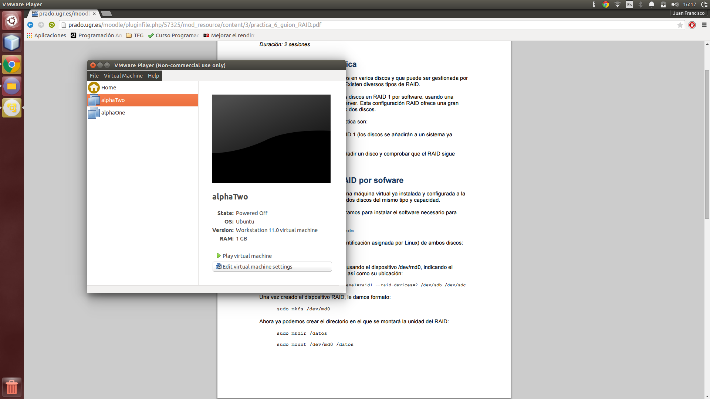

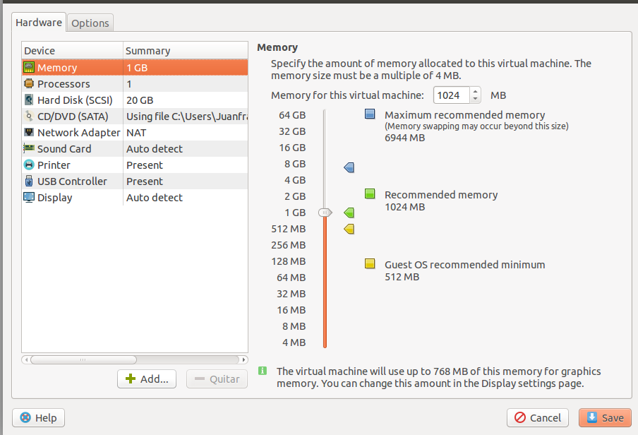

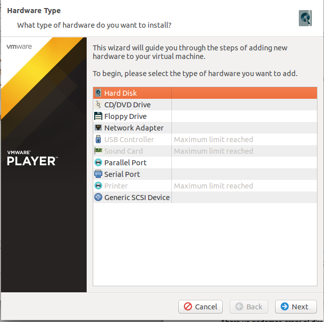

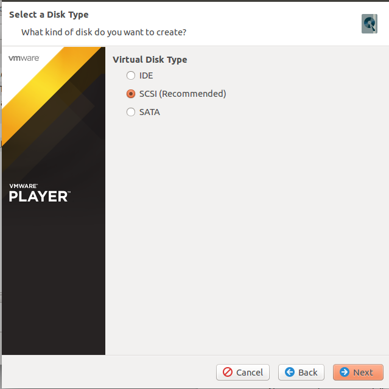

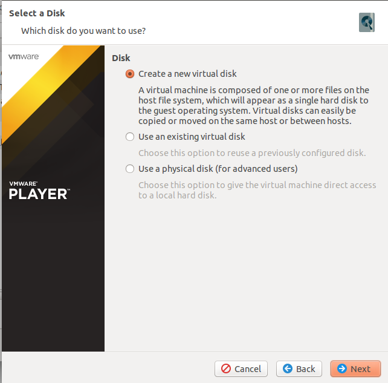

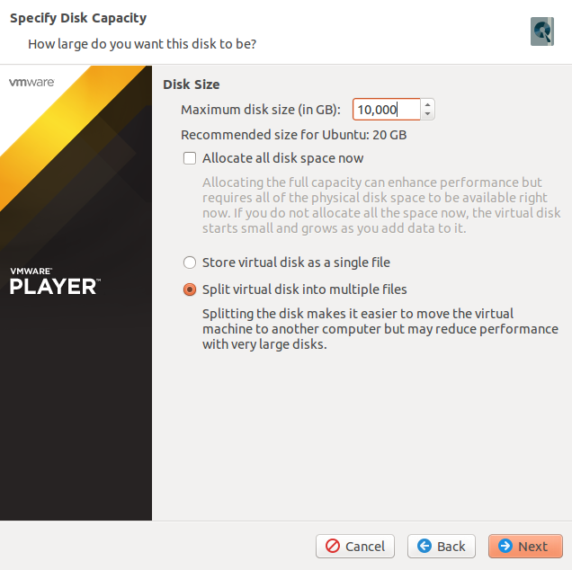

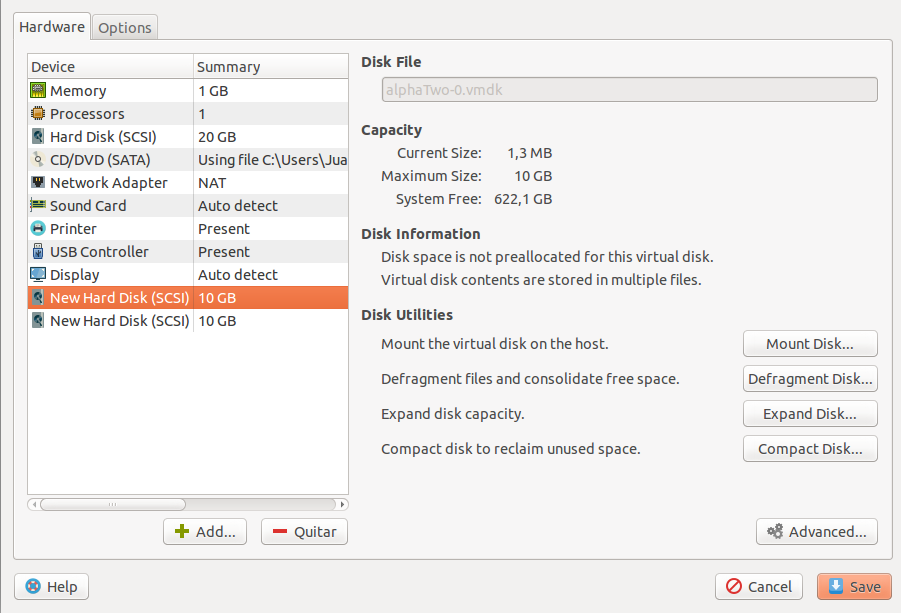

Una vez hallamos creado los discos nos dispondremos a configurar el RAID por software. Para ello, y como primer paso imprescindible en esta práctica, tendremos que instalar mdadm con `sudo apt-get install mdadm`. 

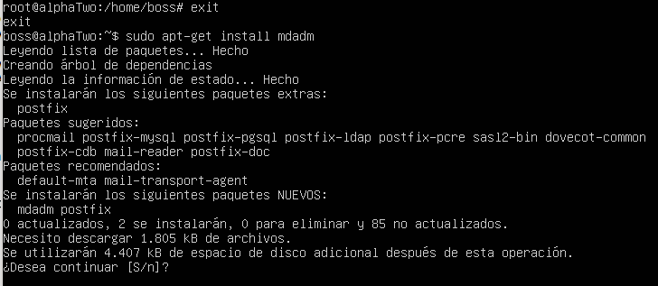

Una vez instalado el programa y antes de continuar configurando nuestro RAID deberemos ver los discos de los que disponemos. Este paso podemos hacerlo con el comando `sudo fdisk -l`, así sabremos el nombre de neustros discos y su estado en el sistema como se muestra en la siguiente imagen: 

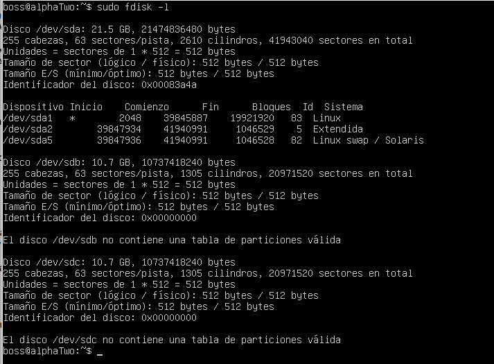

En este momento nos dispondremos a configurar nuestro RAID usando cualquiera de los siguientes dos comandos (ya que son equivalentes): 

* `sudo mdadm -C /dev/md0 --level=raid1 --raid-devices=2 /dev/sdb /dev/sdc` (si usamos este comando tendremos que aceptar que el propio mdadm asigne los metadatos por defecto a la partición).

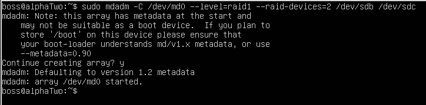

* `sudo mdadm --create --metadata=0.90 /dev/md0 --level=raid1 --raid-devices=2 /dev/sdb /dev/sdc`

Una vez designados los discos para RAID tendremos que darle formato a md0 para luego montarloen  en un directorio llamado "datos". Para darle formato podemos usar el comando `sudo mkfs /dev/md0`. Tras este paso, crearemos el directorio en local con `sudo mkdir /datos` y montaremos md0 en el con `sudo mount /dev/md0 /datos`. 
Una vez montado el RAID comprobaremos su estado con `sudo mdadm --detail /dev/md0`, lo que nos devolverá un resultado similar al siguiente: 

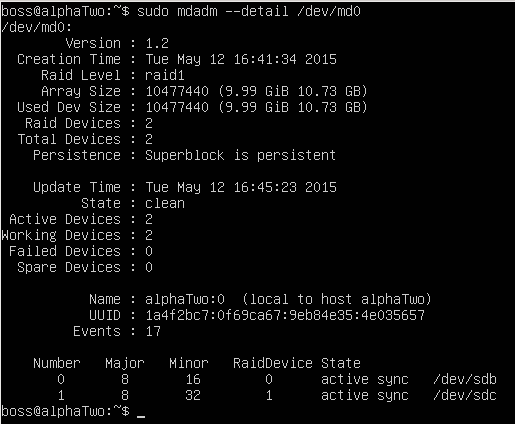

En este momento ya tendremos el RAID configurado y funcioando. El problema es que lo hemos creado de forma manual y tendríamos que volver a montarlo al reiniciar el sistema. 

## Automatización del montaje del RAID al inicio del sistema. 

Para evitar esto tendremos que automatizar el montaje al inicio modificando */etc/fstab* y añadiendo la siguiente línea *dev/md127 /datos ext2 defaults 0 0* (md0 es renombrado por Linux después del primer reinicio por md127, de ahí que ahora se lance el comando con ese nombre).
El fichero *fstab* quedaría como sigue: 

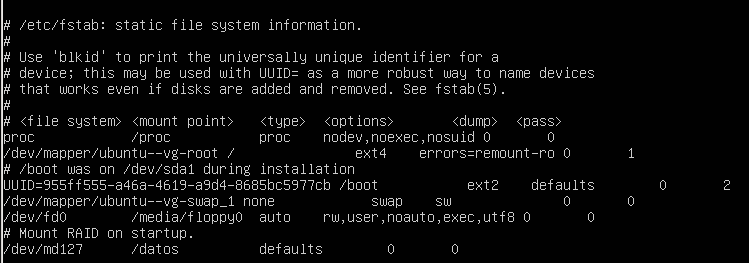

Ahora, con cada reinicio tendremos nuestros discos funcionando. 

## Sustitución de discos en caliente tras fallo. 

Como última sección de la práctica, provocaremos un fallo vía mdadm en uno de los discos que forman el RAID para sustituirlo mietras los demás siguen funcionando. Para provocar el fallo podemos usar el siguiente comando `sudo mdadm --manage --set-faulty /dev/md127 /dev/sdb` que provoca un fallo en el disco *sdb*. Seguidamente, quitaremos el disco con `sudo mdadm --remove /dev/md127 /dev/sdb`. Una vez hecho esto podemos comprobar el estado de nuestra configuración de discos usando `sudo fdisk -l`. El resultado de estos pasos puede verse en la siguiente imagen: 

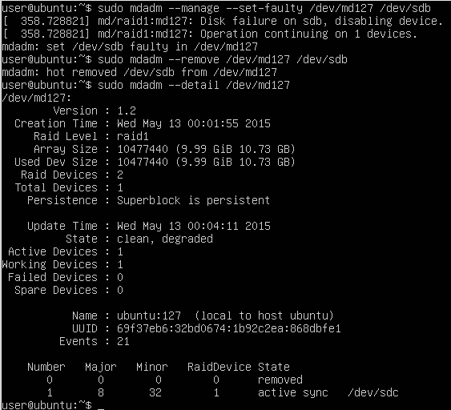

Ahora sólo tendríamos que insertar el disco con `sudo mdadm --add /dev/md127 /dev/sdb`. De nuevo, usando `sudo mdadm --detail /dev/md127`, vemos el estado de los discos. 

El disco insertado estará en estado rebuilding, lo que significa que se está reiniciando y recargando los datos para formar el RAID de nuevo. 
